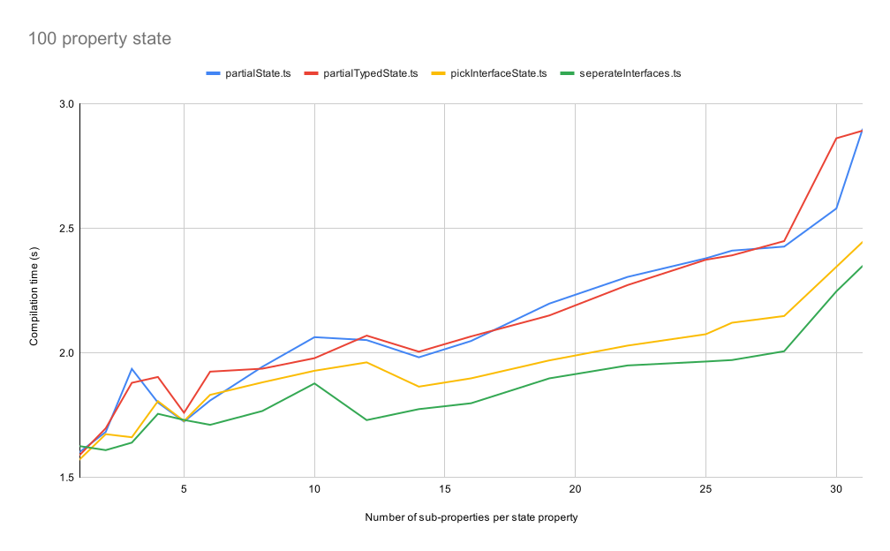

# Benchmark of Typescript sub-reducer typing

The `benchmark.sh` script will compare the compilation performance of three typing strategies for Redux sub-reducers.

- Partial State
  We use a `Partial<State>` return type for all the sub-reducers.
- Partial typed state
  We declare a `type PartialState = Partial<State>` and use that rather than multiple declarations of `Partial`.
- Pick
  On each sub-reducer we type the return as `Pick<State, 'fields' | 'we' | 'assign'>`.
- Seperate Interface
  Each sub-reducer has an interface declared for it's return type.

Below we compare the performance when different numbers of fields are used.

## Single field for each sub-reducer

| Command | Mean [s] | Min [s] | Max [s] | Relative |
|:---|---:|---:|---:|---:|
| `./node_modules/.bin/tsc dist/partialState.ts` | 5.107 ± 0.185 | 4.782 | 5.547 | 1.39 ± 0.05 |
| `./node_modules/.bin/tsc dist/partialTypedState.ts` | 4.867 ± 0.157 | 4.706 | 5.232 | 1.32 ± 0.05 |
| `./node_modules/.bin/tsc dist/pickInterfaceState.ts` | 3.687 ± 0.048 | 3.644 | 3.866 | 1.00 |

## Two field sub-reducers

| Command | Mean [s] | Min [s] | Max [s] | Relative |
|:---|---:|---:|---:|---:|
| `./node_modules/.bin/tsc dist/partialState.ts` | 8.325 ± 0.170 | 7.755 | 8.580 | 1.47 ± 0.05 |
| `./node_modules/.bin/tsc dist/partialTypedState.ts` | 8.421 ± 0.180 | 8.102 | 8.990 | 1.49 ± 0.05 |
| `./node_modules/.bin/tsc dist/pickInterfaceState.ts` | 5.658 ± 0.142 | 5.310 | 5.922 | 1.00 |

## 10 field sub-reducers

| Command | Mean [s] | Min [s] | Max [s] | Relative |
|:---|---:|---:|---:|---:|
| `./node_modules/.bin/tsc dist/partialState.ts` | 34.664 ± 0.885 | 33.696 | 37.696 | 1.93 ± 0.05 |
| `./node_modules/.bin/tsc dist/partialTypedState.ts` | 33.810 ± 0.243 | 33.430 | 34.305 | 1.88 ± 0.02 |
| `./node_modules/.bin/tsc dist/pickInterfaceState.ts` | 18.003 ± 0.195 | 17.769 | 18.574 | 1.00 |
